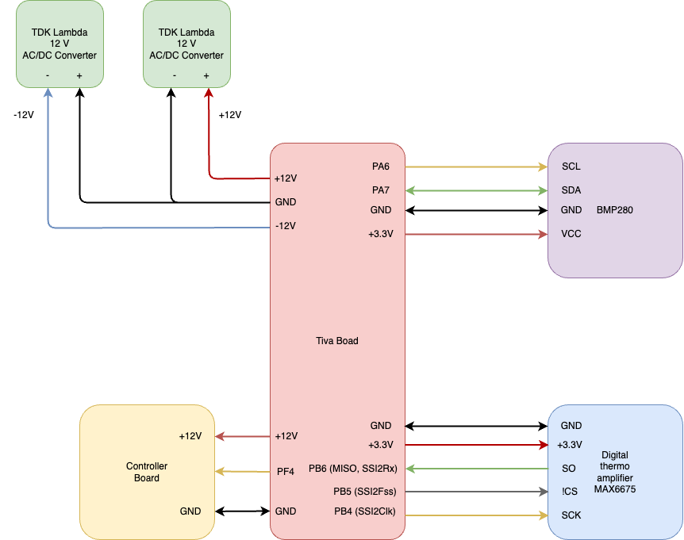

# reflow-oven
DIY reflow oven for SMD soldering

## Scope

In this project, we build an oven for reflow soldering of SMD (surface mount device)
parts, such as for instance microcontrollers etc.
In general, it will help to move away from THT (through hole technology)
boards and enter the realm of SMT (surface mount technology) boards.
This saves space, helps to get rid of evaluation-board-style setups,
and enables fully embedded circuits.

This project is inspired by a reflow oven that I had at the university.
It was a predecessor of this one that you can currently buy at Beta Layout.
https://eu.beta-layout.com/estore/order_product_details.html?wg=1&p=740

Another inspiration is this instructable
https://www.instructables.com/DIY-REFLOW-OVEN/
that shows how to build a DIY oven.

The latter resource ends up with a self-contained oven, as the author wants
to be able to use it as a tool.
It looks really professional and solid.

In this project, I just want to get the oven working in a first step.
Furthermore, I want to use the oven to build an improved version of the controller board.
Also, the oven shall be usable and controllable from my computer.
For this reason, I will not disassemble the oven itself nor use an LCD
display, but just create an MVP which is a controller that
uses the actual oven as is.

## Idea

The general idea is to use an off-the-shelf pizza oven as the central
heating element or oven.
In the process of reflow solering, we need to ensure that the temperature
follows a *reflow soldering profile*.

Therefore, we use a temperature probe to measure the temperature and
feed it back to a microcontroller.

The uC in turn generates a control signal. This is a PWM signal,
as the temperature dynamics is very slow and hence acts as a natural
low-pass filter.
As the uC can only provide the signal, but not the actual power,
we use a solid-state relay (SSR) in order to transform the uC signal
to a mains voltage signal.

## Components

Here is an overview of the essential required components.

| Component                | Manufacturer      | Description                                            | Distributor   | Order no.       | Price (Euro)  |
|--------------------------|-------------------|--------------------------------------------------------|---------------|-----------------|---------------|
| SSR                      | Finder            | Steck-/Printrelais, 1x UM, 250V/10A, 5V, RM3,2         | Reichelt      | FIN 43.41.7 5V  | 5.95          |
| Temperatur probe         | UNI-T             | Temperaturfuehler, Typ K, universal                    | Reichelt      | UT TF-K         | 3.95          |
| ~~Arduino Uno~~          | ~~Arduino~~       | ~~Arduino A000066 Board UNO Rev3 DIL Core ATMega328~~  | ~~Voelkner~~  | ~~A435401~~     | ~~22.29~~     |
| Cortex M4 Eval Board     | TI                | TM4C1236 Evaluation Board with breakout pins           | DigiKey       | 2314937         | ca. 18        |
| Pizza oven               | Severin           | TO 2045 Oven, 1500 W, 100 to 230 deg C                 | Amazon        |                 | 60            |
| Fuse                     |                   | Feinsicherung 5x20mm, superflink (ff), 8A              | Reichelt      | ESKA 520.126    | ca. 2         |
| Fuse holder              |                   | 5 x 20 mm, 250 V, 10 A, black                          | Reichelt      | SCH 31010045    | 1.50          |
| Temperature converter    | Maxim Integrated  | MAX6675 (incl. cold junction compensation)             | Voelkner      | R025452         | ca. 7         |

### SSR

If there is no voltage applied at the input, then pins 11 and 12
(12 being the one close to A1 and A2) are connected.
Pins 11 and 14 are not connected.

The measured resistance between A1 and A2 is 97 Ohm for the 5V DC relay.

Hypothesis: If voltage is applied between A1 and A2 (use additional 22 Ohm resistor, transistor and impedance converter),
then pins 11 and 14 are connected.

This hypothesis is confirmed (using the lab supply):
Attaching 5 V via a 22 Ohm resistor to A1, and putting A2 on ground, makes pins 11 and 14 connected (no
resistance, connectivity test is positive).
Pins 11 and 12 are then disconnected.


### Temperature probe

When the type K thermocouple is plugged into a volt meter,
one can see 0.0 mV.
This is because both the tip as well as the cold junction
are at the same temperature.

If the tip is heated by breathing at it, the voltage rises from 0.1 mV up to 0.3 mV.
When the tip is being put into an open oven that had a nominal temperature of 225 deg C,
the voltage rises to 2.0 mV or 2.1 mV.

Looking at the table from the second reference, this means that the temperature delta
is around 50 deg C (that is, ca. 70 deg C), which seems plausible given that the oven is open
and one can easily put the hand into it.

Resources
1. https://blog.beamex.com/de/thermoelement-kaltstellenkompensation-vergleichsstelle
2. https://www.omega.de/temperature/Z/pdf/z204-205iec.pdf

### Microcontroller

The original plan was to use an Arduino Uno.

However, due to my better experience with the TI Tiva family,
I decided to use the Tiva.
It can be connected to the host PC via USB.

Another benefit of this setup is that the direct host PC connection can
be replaced by a Raspberry Pi that is in turn connected to
the host PC via Wi-Fi.
While this setup is a bit more complex, it allows
for the complete galvanic isolation between host PC
and reflow oven controller.

## Controller PCB

The controller board is a two-stage amplifier.
The signal from the microcontroller is first amplified using a BJT.
This signal is then used to control a relay.

### First version

The first version (revision 1.0.0) of the board has some flaws:
* The transistor connection between collector and emitter is shorted. Potential reasons
    * Solder bridges
    * Defect part
    * Defect board
  
  As a consequence, the red LED is always on.
* The yellow LED is not bright enough with 3.3 V (not even with 5.0 V)
* The LEDs have a much higher forward voltage than I thought they have (red and yellow around 2 V,
  green even 3.3 V)
* Not enough voltage to drive the relay

  Note: The voltage between TP4 and TP5 is 0.566 V, which (at 22 Ohm) corresponds to 25.7 mA.
  According to the datasheet of the 333-2SURC/S400-A8 (red LED), the forward voltage is 2 V, which
  is also what I measured.


Analysis of the defects:

* To address the shorted transistor:
    * Leave for some space between PCB and transistor to reduce the chance of solder bridges
    * Measure another PCB
    * Change the part
* To address the yellow LED: reduce value of R1 (smaller than 1k)
* To have enough voltage for driving the relay (without removing the red LED and replace it by a connection):
    Use +7 V instead of + 5 V to drive the relay.
* Also: Use less current wherever possible for the LEDs. Measure what current they need to be "bright".

Measurements
* 5 V supply voltage
    * TP3 shows 4.9 V
    * TP4 shows 2.975 V
    * TP5 shows 2.420 V
    * R2 measures 21.9 Ohm (between TP4 and TP5)
    * R3 measures 0.99 kOhm
    * Current through red LED: U = R*I --> I = U/R = (2.975-2.420) V / 22 Ohm = 0.555 V / 22 Ohm = 25.23 mA
    * Voltage drop over red LED: 4.9 V - 2.975 V = 1.925 V
    * Voltage between R3 and D3: 2.500 V
    * Voltage drop over R2: 4.9 V - 2.500 V = 2.4 V
    * Voltage drop over D3: 2.5 V
    * Current through green LED: U = R*I --> I = U/R = 2.4 V / 990 Ohm = 2.42 mA
    * Voltage drop over yellow LED (when bright) is 2 V
    * The yellow LED needs 10 mA to be bright
    * Base Emitter Voltage of Transistor is 0.75 V
  
Set R1 to 56 Ohm?

Eigentlich reichen auch 5 mA fuer die gelbe LED, d.h. R1 = 100 Ohm.

### Impedance converter

Due to the switching of the relay, there are some voltage spikes on the transistor,
that is, on the low voltage side of the relay.

Those spikes are less pronounced when using the lab supply and more
pronounced when using the AD/DC converter.
They are there in any case though.

For this reason, an impedance converter or buffer is needed between the
uC pin and the controller board.

So far I tested the setup using this impedance converter and a lab supply
and it works.
In oder to test it without the lab supply I need a second AC/DC converter,
as the OpAmp needs a dual rail supply.

## Controller software

### Modelling of the reflow oven dynamics

The plant is modelled by a time delay followed by two first-order lag elements.

The parameters of the plant are identified by applying a step function
onto the oven. A 30% and 50% PWM signal is used for the step height.
Also, a 100% PWM step is applyied until a temperature of 100 deg C is reached.
In that case, also the cooling down is measured.

Here are some more details for the motivation of a first-order lag.
Note that we assume that there are two in order to model the
different behavior when heating and when cooling.
```
d_theta/dt = q_zu - q_ab

q_zu = K*u
q_ab = alpha*theta

K ... Proportional zur Leistung des Ofens
theta ... Abkuehlkoeffizient

d_theta/dt = K*u - alpha*theta

d_theta/dt + alpha*theta = K*u

s*Theta + alpha*Theta = K*U

(s + alpha) * Theta = K * U

G = Theta / U = K/(s + alpha)

```

### Control design

A PI controller is used for temperature control.
The parameters of this PI controller are parameterized by the Ziegler-Nichols method.


## Tiva pin usage and connection

| Pin on Tiva   | Connected with                                  | Description        |
|---------------|------------------------------------------------:|-------------------:|
| GND           | Analog Thermo amplifier GND                     | Ground             |
| PE3           | Analog Thermo amplifier between 6.8k and 18k    | ADC input          |
| GND           | GND of BMP280 evaluation board                  | Ground             |
| +3.3V         | VCC of BMP280 evaluation board                  | Supply voltage     |
| PA6           | SCL of BMP280 evaluation board                  | I2C clock          |
| PA7           | SDA of BMP280 evaluation board                  | I2C data           |
| PB6           | Digital Thermo amplifier MISO                   | SPI data           |
| PB5           | Digital Thermo amplifier CS                     | SPI CS             |
| PB4           | Digital Thermo amplifier Clock                  | SPI clock          |
| PF4           | Controller board pin 2                          | Relay control      |

See also the following block diagram overview.


