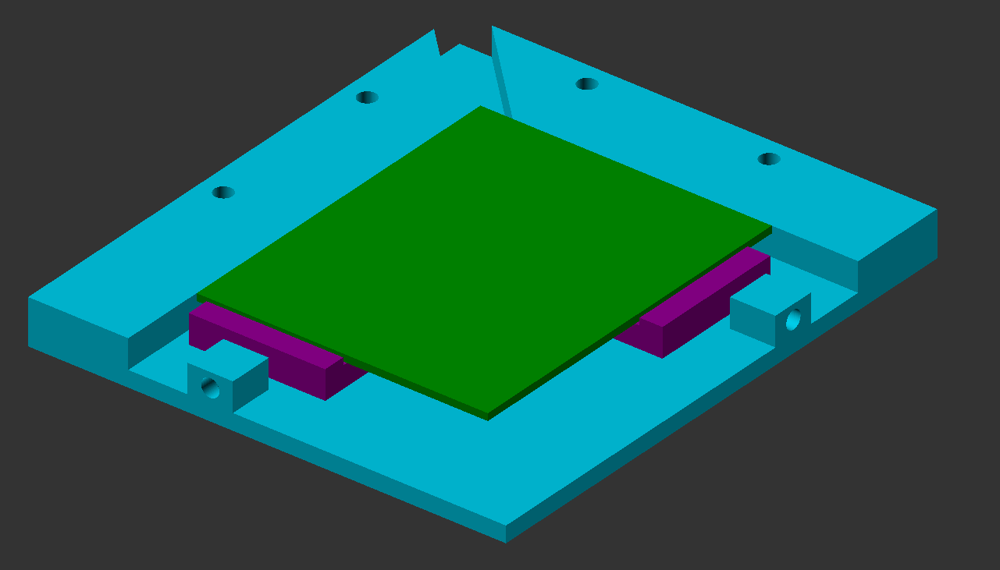
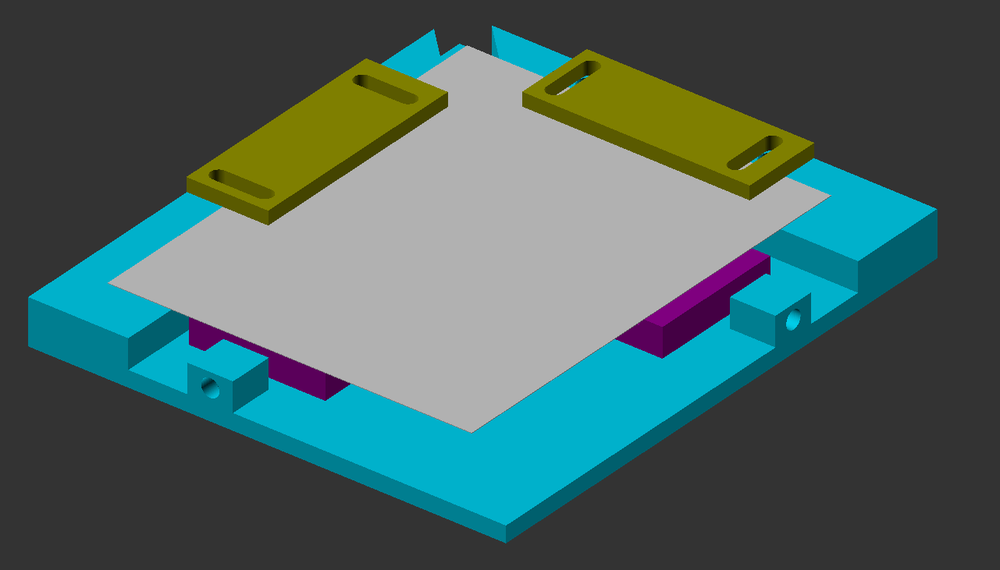

This folder contains the 3D models for the PCB and stencil mount.
Those are used to fixate the PCB and strencil while applying the soldering paste.

The idea is to be able to fixate the PCB and the stencil independently via screws.
No tape shall be used.

PCB without stencil

PCB with stencil
